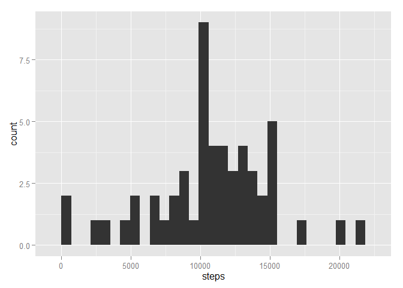

# Reproducible Research: Peer Assessment 1


## Loading and preprocessing the data
Assume activty.zip has been unzipped to activity.csv and exists in the working directory. Load the data into R via the read.csv command. 

```r
data <- read.csv("activity.csv")
```


## What is mean total number of steps taken per day?
Let's start by looking at a histogram of all instances of total daily steps.

```r
library(ggplot2)
summed_steps<-aggregate(steps ~ date, data=data,sum)
ggplot(data=summed_steps,aes(x=steps))+geom_histogram()
```

 

Now we directly calculate the mean and median in R. 

```r
mean(summed_steps$steps)
```

```
## [1] 10766.19
```

```r
median(summed_steps$steps)
```

```
## [1] 10765
```

## What is the average daily activity pattern?
Now we will take the mean steps for each interval and look at a typical day. 

```r
typical_day <- aggregate(steps ~ interval, data=data,mean)
ggplot(data=typical_day,aes(x=interval,y=steps))+geom_line()
```

 

And calculate the interval that corresponds to the most steps in a typical day. 

```r
typical_day$interval[which.max(typical_day$steps)]
```

```
## [1] 835
```

## Imputing missing values
Now we explore missing values and the impact of analysis on replacing these missing values. 
First, the number of total number of missing values is 

```r
sum(is.na(data$steps))
```

```
## [1] 2304
```
Let's replace those missing values with the number of steps from the corresponding interval of a typical day. We will save this as a new dataframe called mod_data and confirm that all NAs have been removed. 

```r
missing_intervals<-data$interval[is.na(data$steps)]
replacement_step <- numeric()
for(i in missing_intervals)
  {replacement_step <- c(replacement_step,typical_day$steps[typical_day$interval==i])}
mod_data<-data
mod_data$steps[is.na(mod_data$steps)]<-replacement_step
sum(is.na(mod_data$steps))
```

```
## [1] 0
```
Now lets revisit the histogram from before

```r
ggplot(data=summed_steps,aes(x=steps))+geom_histogram()
```

 

Now with our new modified set we'll look at the same histogram

```r
mod_summed_steps<-aggregate(steps ~ date, data=mod_data,sum)
ggplot(data=mod_summed_steps,aes(x=steps))+geom_histogram()
```

 

And notice that there aren't any appreciable differences. Let's check more qualitatively by comparing the means and medians of the two sets. 


```r
mean(summed_steps$steps)
```

```
## [1] 10766.19
```

```r
mean(mod_summed_steps$steps)
```

```
## [1] 10766.19
```

```r
median(summed_steps$steps)
```

```
## [1] 10765
```

```r
median(mod_summed_steps$steps)
```

```
## [1] 10766.19
```

It appears our efforts to replace missing values has no effect on the mean and a very small effect on the median. 

## Are there differences in activity patterns between weekdays and weekends?
Now we will explore the difference between weekdays and weekends using the modifed dataset from the previous section. First step is to add a factor variable to our dataframe to signify if it is the weekend


```r
mod_data$daytype <- as.factor(weekdays(as.POSIXlt(mod_data$date)) %in% c("Saturday","Sunday"))
levels(mod_data$daytype)[levels(mod_data$daytype)=="TRUE"]<-"weekend"
levels(mod_data$daytype)[levels(mod_data$daytype)=="FALSE"]<-"weekday"
```

Now lets create the typical day for weekdays and weekends and plot 

```r
typical_day2 <- aggregate(steps ~ interval+daytype, data=mod_data,mean)
ggplot(typical_day2, aes(x=interval,y=steps))+geom_line()+facet_grid(daytype~.)
```

 

